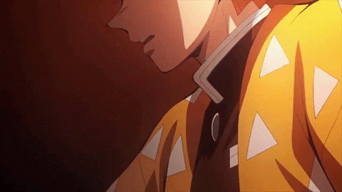

  

<!-- Divider 1 -->

  

# 👨‍💻 About Me

  

  

  

  

<!-- Divider 2 -->

  

# 🛠 Tech Stack

<!-- Divider 4 -->

  

# 📈 Activity Graph

<!-- Divider 5 -->

  

<!-- Divider 6 -->

  

# 💬 Dev Quote

<!-- Divider 7 -->

  

# 🐍 Snake Contribution

<!-- Divider -->

  

# 📬 Contact Me

<!-- Divider -->

  

